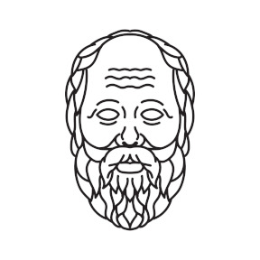

# STM32F4 Socrates

 

  

## About The Project

Socrates (469–399 BC) spent most of his life dialoguing with people in the streets and public squares of the city. *Trees won't teach me anything*, he once said. He and his conversation partners explored subjects through a process of **Question** and **Answer**; a technique now known as **Socratic Method**.

In another moment, upon seeing a vast array of goods for sale, Socrates remarked, *How many things I can do without!*.

STM32F4 Socrates Project applies this Socratic approach to implement a **Command Processor** for the STM32F4 family. It follows the principles of the Socratic Method within a simplified environment using a minimal set of tools.

## Documentation

Refer to [SUMMARY](docs/book/SUMMARY.md).

## Contributing

If you have suggestions for how Open Source Projects Template could be improved, or want to report a bug, open an issue! We'd love all and any contributions.

For more, check out the [Contributing Guide](.github/CONTRIBUTING.md).

## License

MIT License

Copyright (c) 2025 abelbarreira

For more, check out the [License File](LICENSE).
